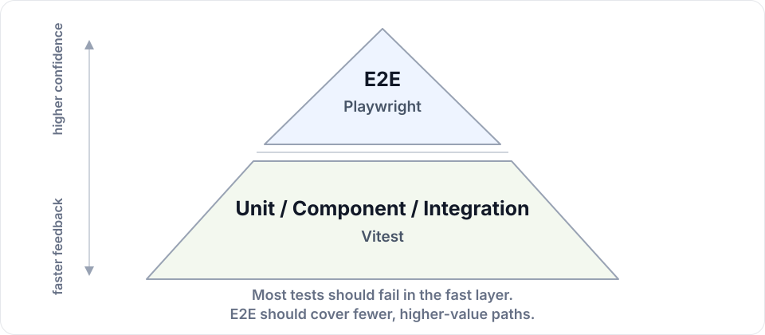

# vitest-plugin-rsc

> Test React Server Components and Next.js App Router apps in Vitest Browser Mode.

[](https://www.npmjs.com/package/vitest-plugin-rsc)
[](https://github.com/storybookjs/vitest-plugin-rsc/actions/workflows/ci.yml)
[](LICENSE)
[](https://nodejs.org/)
[](https://pnpm.io/)

`vitest-plugin-rsc` runs your server code in Vitest Browser Mode, in the same browser test runtime as your assertions. For a Next.js app, that's the whole app: Next's own request handler renders a route, the browser shows the HTML, and Next's own client code hydrates it.

That unlocks a kind of test unit tests and E2E tests can't easily reach:

**DB → RSC → pixels → actions → DB → pixels. One slice at a time.**

Pick one piece of the app — a wishlist carousel, a notes form, a settings panel, or a whole route. Seed exactly the state that piece needs, render it, interact with the hydrated UI in a real browser, run Server Actions, and assert what the user sees and what the server stored.

## Table Of Contents

- [Why This Exists](#why-this-exists)
- [What You Get](#what-you-get)
- [Requirements](#requirements)
- [Next.js](#nextjs)
  - [Set Up](#set-up)
  - [Render A Component](#render-a-component)
  - [Render It Again](#render-it-again)
  - [A Test File With `"use client"`](#a-test-file-with-use-client)
  - [Example: Server Action Form](#example-server-action-form)
  - [Router Hooks And Links](#router-hooks-and-links)
  - [Request Headers And Cookies](#request-headers-and-cookies)
  - [Cache And Revalidation](#cache-and-revalidation)
  - [Open A Whole Route](#open-a-whole-route)
  - [Route Handlers](#route-handlers)
  - [Code That A Server Action Calls](#code-that-a-server-action-calls)
  - [The Proxy, Redirects And Rewrites](#the-proxy-redirects-and-rewrites)
  - [Mocks](#mocks)
  - [Fonts, Images And Styles](#fonts-images-and-styles)
  - [Server Code In The Browser](#server-code-in-the-browser)
  - [Example: Drizzle + PGlite](#example-drizzle--pglite)
  - [Storybook And Other Hosts](#storybook-and-other-hosts)
  - [A Static Build](#a-static-build)
  - [API](#api)
- [React Server Components Without Next.js](#react-server-components-without-nextjs)
- [Server Code That Runs In A Browser](#server-code-that-runs-in-a-browser)
- [Test Concurrency](#test-concurrency)
- [How It Works](#how-it-works)
- [Playgrounds](#playgrounds)

## Why This Exists

Covering every state with only E2E is usually impractical. E2E runs are slow because each test has to drive the UI into the state you want to assert against, hard to parallelize because tests share infrastructure, and flaky because they aren't isolated. Validation errors, user roles, locales, feature flags, loading/empty/error states, time-dependent UI — most of those variants just get skipped. That coverage belongs at the base of the test pyramid.

<p align="center">
  
</p>

For React Server Components, that base has been missing. Rendering Server Components inside a unit-style test process has been [an open problem since 2023](https://github.com/testing-library/react-testing-library/issues/1209), so the whole RSC pipeline got pushed up to E2E — exactly where broad variant coverage doesn't fit.

`vitest-plugin-rsc` fills the missing base. A single component, form, or whole route runs through the full RSC pipeline — server render, Flight, HTML, hydration, Server Action, rerender — with white-box control over the inputs and assertions on the rendered DOM.

Your assertions stay user-facing and your setup stays direct:

```tsx
test("archive a note", async () => {
  // seed DB
  await signInAs(testUser);
  await db.insert(notes).values({ ownerId: testUser.id, title: "Inbox triage" });

  // RSC -> pixels
  await renderServer(<NotesPage />, { url: "/notes" });
  await expect.element(page.getByText("Inbox triage")).toBeVisible();

  // action -> DB -> pixels
  await page.getByRole("button", { name: "Archive Inbox triage" }).click();
  await expect.element(page.getByText("Inbox triage")).not.toBeInTheDocument();
});
```

Agents do dramatically better when wrapped in a self-healing loop with fast unit tests — edit, run tests, repair, repeat — and RSC has been the hardest React surface to put in that loop.

## What You Get

- **Real Next.js behavior**: The request goes through Next's own route resolution, request handler, renderer, and router. Layouts, `loading.tsx`, error boundaries, redirects, cookies, Server Actions, route handlers, and the Data Cache do what they do in your app, and so do `proxy.ts` and the redirects, rewrites, and headers in `next.config`.
- **Next's own compiler**: Your source files go through Next's SWC transform and its font and image loaders, so `next/font`, `next/image`, `next/dynamic`, and styled-jsx work, and a mistake that would stop `next build` fails the test with Next's error.
- **Focused scope**: Test a whole route, a single component, a form, or a flow without booting the whole deployed app.
- **White-box inputs**: The server runs in the test runtime, so the `db` your test seeds is the module instance your Server Components read. Set auth/session state, mock IO, fake clocks, and set cookies/headers.
- **Black-box output**: Assert what the user sees and does via `vitest/browser` — Playwright locators (`getByRole`, `getByText`, etc.) and `expect.element` matchers.
- **Watch mode**: With `vitestPluginNext({ affectedTests: true })`, an edit reruns just the tests that use that file. See [Watch Mode](docs/next-routes.md#watch-mode).
- **No deployed infra**: Use in-memory infrastructure like PGlite instead of spinning up a preview server and database.
- **Per-test isolation**: Each test starts with an empty Data Cache, no cookies, and none of what the app put in `localStorage` or `sessionStorage`.

## Requirements

- Vite 8 or later, and Vitest 5.0.3 or later in [Browser Mode](https://vitest.dev/guide/browser/). The examples use Playwright as the browser provider.
- For Next.js: the App Router, `next@16.4` or later, and [`@next/routing`](https://www.npmjs.com/package/@next/routing), Next's own route resolution, at the same version as `next`.

The plugin calls Next.js internals, so CI tests against `next@16.4.0`, `next@latest`, and `next@canary`.

## Next.js

### Set Up

```bash
npm install -D vitest-plugin-rsc vitest @vitest/browser-playwright playwright
# Next's own route resolution, at the same version as your `next`.
npm install -D @next/routing@$(node -p "require('next/package.json').version")
```

`@next/routing` has to be the same version as your `next`, so upgrade them together, like `eslint-config-next`.

```ts
// vitest.config.ts
import { playwright } from "@vitest/browser-playwright";
import { defineConfig } from "vitest/config";
import { vitestPluginRSC } from "vitest-plugin-rsc";
import { vitestPluginNext } from "vitest-plugin-rsc/nextjs/plugin";

export default defineConfig({
  plugins: [vitestPluginRSC(), vitestPluginNext()],
  test: {
    include: ["**/*.test.{ts,tsx}"],
    browser: {
      enabled: true,
      headless: true,
      provider: playwright(),
      instances: [{ browser: "chromium" }],
    },
    isolate: false,
  },
});
```

`vitestPluginNext()` reads your app from the project root. You don't need a setup file: the plugin cleans up before and after every test.

With `isolate: false`, the app's server loads once per worker instead of once per test file. It also means mocks are shared, which is why they belong in a setup file — see [Mocks](#mocks).

### Render A Component

Pass a node to test one component instead of a whole page. It renders the way Testing Library renders a component: in a `<div>` container in `document.body`, without your app's layouts. Everything around it is still Next: the request, the cookies, Server Actions, the cache, and the router.

Without a `url`, the node renders at `/`. With a `url`, the pathname, search params, and route params come from it. The URL goes straight to your route, past `proxy.ts`, so a component behind a sign-in renders without one.

`wrapper` wraps the node on the server, for the providers a layout would give it. It can be a Server Component:

```tsx
import { headers } from "next/headers";
import type { ReactNode } from "react";
import { Counter } from "./components/counter.tsx";

async function Tenant({ children }: { children: ReactNode }) {
  const tenant = (await headers()).get("x-tenant");
  return <section aria-label={`Tenant ${tenant}`}>{children}</section>;
}

test("wraps a node in a wrapper, which can be a Server Component", async () => {
  await renderServer(<Counter />, { wrapper: Tenant, headers: { "x-tenant": "acme" } });

  const tenant = page.getByRole("region", { name: "Tenant acme" });
  await tenant.getByRole("button", { name: "Count: 0" }).click();
  await expect.element(tenant.getByRole("button", { name: "Count: 1" })).toBeVisible();
});
```

`layouts: true` renders the node inside your app's layouts for that `url`, with everything they give it: providers, global CSS, and the data a layout reads. Without it, a node has the CSS of what its test file and the setup files import: import the global CSS of your root layout in a setup file to have it there.

```tsx
import { RouterState } from "./components/router-state.tsx";

test("renders a node in place of a page, inside the layouts of the app", async () => {
  await renderServer(<RouterState />, { url: "/notes/7?q=1", layouts: true });

  // The root layout of the app, around the node.
  await expect.element(page.getByRole("navigation", { name: "Main" })).toBeVisible();
  const router = page.getByRole("main").getByRole("definition");
  await expect.element(router.nth(1)).toHaveTextContent('{"id":"7"}');
});
```

Two options decide how much of your app is around what you render: `proxy` runs `proxy.ts`, and `layouts` renders your layouts. `proxy` covers the redirects, rewrites, and headers of `next.config` too.

|                                   | `proxy` | `layouts` |
| --------------------------------- | ------- | --------- |
| `renderServer({ url })`           | `true`  | `true`    |
| `renderServer(<Node />, { url })` | `false` | `false`   |

Set them per test, like a component in the layouts of its route, behind the proxy that guards it:

```tsx
import { headers } from "next/headers";

// Reads the header that proxy.ts adds for a signed-in visitor.
async function Team() {
  return <p>Team: {(await headers()).get("x-team")}</p>;
}

test("renders a node in the layouts of a route, behind the proxy", async () => {
  document.cookie = "session=ada";

  await renderServer(<Team />, { url: "/team", layouts: true, proxy: true });

  await expect.element(page.getByRole("main")).toHaveTextContent("Team: core");
});
```

### Render It Again

`rerender()` renders another node in place of the node, like Testing Library's `rerender`, and without a page load. The server renders it in one request of Next's router, as `router.refresh()` does, and React updates the page in place. So the state of the Client Components in it stays:

```tsx
import { Greeting } from "./components/greeting.tsx";

test("keeps the count of the counter when the name changes", async () => {
  const { rerender } = await renderServer(<Greeting name="Ada" />);
  await page.getByRole("button", { name: "Count: 0" }).click();

  await rerender(<Greeting name="Grace" />);

  await expect.element(page.getByRole("heading", { name: "Hello Grace" })).toBeVisible();
  await expect.element(page.getByRole("button", { name: "Count: 1" })).toBeVisible();
});
```

It resolves once the page shows the new node. The rest stays as `renderServer()` got it: the `url`, the `wrapper`, `proxy`, `layouts` and the `headers`, which go with the request of `rerender()` as with every request of the page. For another URL or other headers, call `renderServer()` again: that is a new request. In a test file with `"use client"` the node renders again in the browser, without a request.

A node that throws while it renders again resolves with an error page in its place, as a page shows it. From there `rerender()` rejects: the page no longer has the node. So it does after `unmount()`, after a navigation that loaded another page, and when a not-found page or another route took the node's place. A page that `renderServer({ url })` opened has no node to replace, and no `rerender()`.

### A Test File With `"use client"`

A test file with `"use client"` is code of the browser, as such a file is in Next. `renderServer()` in it renders the node in the browser and not on the server: a prop can be a function, like a spy, and a component of the test file can have state. The node is still the page of a route in Next's own app, so `<Link>`, `useRouter()` and `usePathname()` are Next's, at `url`.

```tsx
"use client";

import { expect, test, vi } from "vitest";
import { page } from "vitest/browser";
import { renderServer } from "vitest-plugin-rsc/nextjs/testing-library";
import { PressButton } from "./components/press-button.tsx";

test("passes a function to a Client Component, which calls it", async () => {
  const onPress = vi.fn();

  await renderServer(<PressButton onPress={onPress}>Press</PressButton>);

  await page.getByRole("button", { name: "Press" }).click();
  expect(onPress).toHaveBeenCalledOnce();
});
```

Every page load has modules of its own, as in a browser, and the file reads `PressButton` from the page that is open. What that means for such a file:

- What it imports is the browser's copy of a module. A `db` it imports is not the one your Server Components read, so seed the server in a setup file or in a test file without the directive.
- `vi.mock()` and `vi.hoisted()` are an error in it: Vitest mocks the modules of the server's layer. See [Mocks](#mocks).
- A value it computes from an import when it loads, like `const Memo = memo(Button)` at its top, is of the first page. Make it in the test.

### Example: Server Action Form

A full `page.tsx` route here; the same pattern works for any component, form, or flow.

The page is a Server Component with a Server Action. On a validation error, the action writes the message to a cookie and calls `refresh()`.

```tsx
// app/notes/new/page.tsx
import { refresh } from "next/cache";
import { cookies } from "next/headers";
import { redirect } from "next/navigation";

import { notes } from "#db/schema.ts";
import { requireUser } from "#lib/auth-session.ts";
import { db } from "#lib/db.ts";

export default async function NewNotePage() {
  const user = await requireUser();
  const error = (await cookies()).get("note-error")?.value;

  return (
    <form
      action={async (formData) => {
        "use server";

        const title = String(formData.get("title") ?? "").trim();
        const content = String(formData.get("content") ?? "");

        if (!title) {
          (await cookies()).set("note-error", "Title is required.");
          refresh();
          return;
        }

        await db.insert(notes).values({ ownerId: user.id, title, content });
        redirect("/notes");
      }}
    >
      <label htmlFor="title">Title</label>
      <input id="title" name="title" />
      {error && <p>{error}</p>}

      <label htmlFor="content">Content</label>
      <textarea id="content" name="content" />

      <button>Create note</button>
    </form>
  );
}
```

The test seeds both server-side state (auth, database) and browser-side state (`localStorage`), renders the page, interacts with the form, and asserts the rerendered UI:

```tsx
import { expect, test } from "vitest";
import { page } from "vitest/browser";
import { renderServer } from "vitest-plugin-rsc/nextjs/testing-library";

import { db } from "#lib/db.ts";
import { notes } from "#db/schema.ts";
import { signInAs, testUser } from "#test/auth.ts";
import NewNotePage from "./page.tsx";

test("validates a new note without losing entered content", async () => {
  await signInAs(testUser);
  localStorage.setItem("theme", "dark");

  await db.insert(notes).values({
    ownerId: testUser.id,
    title: "Inbox triage",
    content: "Existing note body",
  });

  await renderServer(<NewNotePage />, { url: "/notes/new" });

  await page.getByLabelText("Content").fill("Keep this body");
  await page.getByRole("button", { name: "Create note" }).click();

  await expect.element(page.getByText("Title is required.")).toBeInTheDocument();
  await expect.element(page.getByDisplayValue("Keep this body")).toBeInTheDocument();
});
```

That single test sets up:

- **Server-side state**: the signed-in user (`signInAs`) and a seeded database row (`db.insert`)
- **Browser-side state**: a client-side preference written to `localStorage`

Setting server and browser state in the same setup is something a pure unit test cannot reach and a full E2E test can only do through the real UI.

`vi.mock("#lib/db.ts")` in the setup file replaces the production database adapter with the Vitest `__mocks__` version next to it (`lib/__mocks__/db.ts`). The mock exposes a `db` reference and a `resetDb` helper that the setup file points at a fresh PGlite clone per test. See [Drizzle + PGlite](#example-drizzle--pglite) below for the wiring.

### Router Hooks And Links

Many tests can omit routing options:

```tsx
await renderServer(<CreateNoteForm />);
```

Pass `url` when the component needs location-aware behavior — `usePathname`, `useSearchParams`, `useParams`, `next/link`, or request URL-dependent code. The params come from your app's route for that URL:

```tsx
import { expect, test } from "vitest";
import { page } from "vitest/browser";
import { renderServer } from "vitest-plugin-rsc/nextjs/testing-library";

import { NoteToolbar } from "./note-toolbar";

test("reads router state and navigates", async () => {
  await renderServer(<NoteToolbar />, { url: "/notes/123?tab=activity" });

  await expect.element(page.getByText("pathname: /notes/123")).toBeVisible();
  await expect.element(page.getByText("note id: 123")).toBeVisible();
  await expect.element(page.getByText("tab: activity")).toBeVisible();

  await page.getByRole("button", { name: "Go to notes" }).click();
  await expect.poll(() => window.location.pathname).toBe("/notes");
});
```

Navigating to another route of your app opens that page, with its layouts, like a click in the browser does.

For example, a client component can use normal Next APIs:

```tsx
"use client";

import Link from "next/link";
import { useParams, usePathname, useRouter, useSearchParams } from "next/navigation";

export function NoteToolbar() {
  const router = useRouter();
  const pathname = usePathname();
  const params = useParams<{ id: string }>();
  const searchParams = useSearchParams();

  return (
    <>
      <p>pathname: {pathname}</p>
      <p>note id: {params.id}</p>
      <p>tab: {searchParams.get("tab")}</p>
      <button onClick={() => router.push("/notes")}>Go to notes</button>
      <Link href={{ pathname: "/notes/new", query: { from: params.id } }}>New note</Link>
    </>
  );
}
```

### Request Headers And Cookies

Pass request headers into `renderServer`. Inside Server Components and Server Actions, use Next's `headers()` and `cookies()` APIs as you normally would.

The headers go with every request the browser sends to your app from then on, not only the first one: Server Actions, `router.refresh()`, navigations, and `fetch` calls get them too, until the test opens something else or ends. That is what you want for a header that a server in front of your app adds to every request, like `x-forwarded-for`. A request keeps the headers it sets itself. Two headers are for the first request alone: `cookie`, after which the browser's cookies are sent, and `accept`.

```tsx
import { expect, test } from "vitest";
import { page } from "vitest/browser";
import { renderServer } from "vitest-plugin-rsc/nextjs/testing-library";

import { FlashProbe } from "./flash-probe";

test("reads request headers and mutates cookies from an action", async () => {
  const requestHeaders = new Headers();
  requestHeaders.set("x-test-request", "from-test");
  requestHeaders.set("cookie", "flash=initial");

  await renderServer(<FlashProbe />, {
    url: "/flash",
    headers: requestHeaders,
  });

  await expect.element(page.getByText("request id: from-test")).toBeVisible();
  await expect.element(page.getByText("flash: initial")).toBeVisible();

  await page.getByRole("button", { name: "Save flash" }).click();
  await expect.element(page.getByText("flash: saved")).toBeVisible();
});
```

```tsx
import { refresh } from "next/cache";
import { cookies, headers } from "next/headers";

export async function FlashProbe() {
  const requestId = (await headers()).get("x-test-request");
  const flash = (await cookies()).get("flash")?.value ?? "empty";

  return (
    <form
      action={async () => {
        "use server";

        (await cookies()).set("flash", "saved", { path: "/" });
        refresh();
      }}
    >
      <p>request id: {requestId}</p>
      <p>flash: {flash}</p>
      <button>Save flash</button>
    </form>
  );
}
```

### Cache And Revalidation

Server Components can use tagged cached `fetch` calls, and Server Actions can refresh the current tree or invalidate those tags. The outbound `fetch` is intercepted by MSW in tests — see [`playground/nextjs-notes-demo`](playground/nextjs-notes-demo) for a worked setup.

```tsx
import { refresh, revalidatePath, revalidateTag, updateTag } from "next/cache";

import { createNote } from "#lib/notes";

async function readNotes() {
  const response = await fetch("https://example.test/api/notes", {
    cache: "force-cache",
    next: { tags: ["notes"] },
  });
  return response.json() as Promise<Array<{ id: string; title: string }>>;
}

export async function NotesPanel() {
  const notes = await readNotes();

  return (
    <section>
      <p>notes: {notes.length}</p>
      <form
        action={async () => {
          "use server";

          await createNote({ title: "New note" });
          updateTag("notes");
        }}
      >
        <button>Create note</button>
      </form>
      <form
        action={async () => {
          "use server";

          revalidateTag("notes", "max");
          refresh();
        }}
      >
        <button>Refresh stale notes</button>
      </form>
      <form
        action={async () => {
          "use server";

          revalidateTag("notes", { expire: 0 });
        }}
      >
        <button>Expire notes cache</button>
      </form>
      <form
        action={async () => {
          "use server";

          revalidatePath("/notes", "page");
        }}
      >
        <button>Revalidate notes page</button>
      </form>
    </section>
  );
}
```

The test still looks like a unit test. After the click, `updateTag("notes")` invalidates the cached fetch, the panel re-renders, and the assertion sees the new count:

```tsx
import { expect, test } from "vitest";
import { page } from "vitest/browser";
import { renderServer } from "vitest-plugin-rsc/nextjs/testing-library";

import { NotesPanel } from "./notes-panel";

test("creating a note invalidates the notes cache", async () => {
  await renderServer(<NotesPanel />, { url: "/notes" });

  await expect.element(page.getByText("notes: 0")).toBeVisible();
  await page.getByRole("button", { name: "Create note" }).click();
  await expect.element(page.getByText("notes: 1")).toBeVisible();
});
```

### Open A Whole Route

`renderServer({ url })` opens a route the way a browser does. The request goes to Next's request handler, the browser shows the HTML it sends back, and Next's client code hydrates it. It resolves once the page has hydrated. From there, Next's router is in charge, so links, forms, and redirects behave as they do in your app.

```tsx
import { expect, test } from "vitest";
import { page } from "vitest/browser";
import { renderServer } from "vitest-plugin-rsc/nextjs/testing-library";
import { db } from "./lib/notes.ts";

test("navigates on the client with next/link", async () => {
  db.notes.set("1", { id: "1", title: "Inbox triage", body: "Sort the inbox" });
  await renderServer({ url: "/" });

  await page.getByRole("link", { name: "Notes", exact: true }).click();
  await expect.element(page.getByRole("heading", { name: "Notes" })).toBeVisible();
  expect(window.location.pathname).toBe("/notes");

  await page.getByRole("link", { name: "Inbox triage" }).click();
  await expect.element(page.getByText("Sort the inbox")).toBeVisible();
  expect(window.location.pathname).toBe("/notes/1");
  await expect.poll(() => document.title).toBe("Inbox triage | Notes");
});
```

`renderServer` resolves with `{ response, unmount }`: the server's `Response` to the document request, and a function that leaves the page.

```tsx
const { response } = await renderServer({ url: "/" });

expect(response.status).toBe(200);
```

Cookies you set on `document.cookie` are sent with the request, and so are the `headers` you pass. The headers go with every request of the page after it too, see [Request Headers And Cookies](#request-headers-and-cookies).

```tsx
test("sends the cookies the test sets before it opens a page", async () => {
  document.cookie = "last-created=7";

  await renderServer({ url: "/notes" });

  await expect.element(page.getByText("Last created: 7")).toBeVisible();
});
```

A URL that isn't a route gets your app's not-found page, with status `404`.

### Route Handlers

`handleRequest(url, init)` sends one request to the app and resolves with the response. It takes what `fetch` takes. Use it when the response is what you assert on: a status, a header, the HTML, or the Flight payload. The request carries the browser's cookies, and the browser stores the cookies the server sets. It carries the `headers` of what `renderServer` opened too, under its own.

Route handlers (`app/**/route.ts`) are served too, and `handleRequest` is how a test calls one:

```ts
import { expect, test } from "vitest";
import { handleRequest } from "vitest-plugin-rsc/nextjs/testing-library";
import { db } from "../lib/notes.ts";

test("gives a route handler the body of a request and the cookies of the browser", async () => {
  db.notes.set("1", { id: "1", title: "Inbox triage", body: "Sort the inbox" });
  document.cookie = "editor=kasper";

  const response = await handleRequest("/api/notes/1", {
    method: "PUT",
    headers: { "content-type": "application/json" },
    body: JSON.stringify({ title: "Inbox zero" }),
  });

  expect(await response.json()).toEqual({
    note: { id: "1", title: "Inbox zero", body: "Sort the inbox" },
    editor: "kasper",
  });
  expect(db.notes.get("1")?.title).toBe("Inbox zero");
  // Set with cookies() in the handler.
  expect(document.cookie).toContain("last-renamed=1");
});
```

A `fetch` from a Client Component to a route handler reaches it too, with the browser's cookies.

### Code That A Server Action Calls

A form's Server Action is best tested through its page: fill in the form and submit it. For the code that a Server Action calls, `runInServerAction(fn, { url })` runs a function as a Server Action of the page at `url`, in the request of the action. `cookies()` can be set there, and `redirect()`, `refresh()` and `after()` work. It resolves with what the function returns and rejects with what it throws, also the error of a `redirect()` or a `notFound()`:

```ts
import { isRedirectError } from "next/dist/client/components/redirect-error";
import { expect, test } from "vitest";
import { runInServerAction } from "vitest-plugin-rsc/nextjs/testing-library";
import { createNote, setLanguage } from "../lib/actions.ts";
import { db } from "../lib/notes.ts";

test("keeps the cookies an action sets", async () => {
  await runInServerAction(() => setLanguage("nl"));

  expect(document.cookie).toContain("language=nl");
});

test("creates the note and redirects", async () => {
  const formData = new FormData();
  formData.set("title", "Plan the week");

  const error = await runInServerAction(() => createNote(formData)).catch((error) => error);

  expect(isRedirectError(error)).toBe(true);
  expect(db.notes.get("1")?.title).toBe("Plan the week");
});
```

It sends a Server Action request like the one of Next's router, to a route at `url` that renders nothing, and opens no page: no app starts, so it is much faster than a page with a form. After a `redirect()`, Next renders the page it redirects to on the server, as it does for the router. A page that is open stays open. The function and its result are the test's own, so they do not go through Flight.

The request carries the browser's cookies, the `headers` of what `renderServer()` opened and the ones you pass, and the browser keeps the cookies the action sets. With `proxy: true` it goes through the proxy, and a redirect there rejects, since the action did not run.

The function runs in the request of the action, so it cannot send a request to the app itself: that would wait for this one. Call the app's code instead. What it throws, Next also reports with `console.error`, as it does for any Server Action.

### The Proxy, Redirects And Rewrites

`proxy.ts` and the `redirects`, `rewrites`, and `headers` in `next.config` run here too, through Next's own route resolution.

```ts
// proxy.ts
import { NextResponse, type NextRequest } from "next/server";

export function proxy(request: NextRequest) {
  const { pathname } = request.nextUrl;
  // Sends a visitor without a session elsewhere.
  if (pathname === "/team" && !request.cookies.has("session")) {
    const account = new URL("/account", request.url);
    account.searchParams.set("from", pathname);
    return NextResponse.redirect(account);
  }
  // Serves another route at this URL.
  if (pathname.startsWith("/go/")) {
    return NextResponse.rewrite(new URL(`/docs/${pathname.slice("/go/".length)}`, request.url));
  }
}
```

```tsx
import { expect, test } from "vitest";
import { page } from "vitest/browser";
import { handleRequest, renderServer } from "vitest-plugin-rsc/nextjs/testing-library";

test("follows a redirect of the proxy", async () => {
  const response = await handleRequest("/team", { redirect: "manual" });

  expect(response.status).toBe(307);
  expect(response.headers.get("location")).toBe("/account?from=%2Fteam");

  await renderServer({ url: "/team" });

  await expect.element(page.getByRole("heading", { name: "Account" })).toBeVisible();
  expect(window.location.pathname + window.location.search).toBe("/account?from=%2Fteam");
});

test("serves the route the proxy rewrites to, at the URL that was asked for", async () => {
  await renderServer({ url: "/go/routing" });

  await expect.element(page.getByRole("heading", { name: "Docs: routing" })).toBeVisible();
  expect(window.location.pathname).toBe("/go/routing");
});
```

`proxy: false` opens the route at exactly the URL you give, without the proxy or the redirects, rewrites, and headers of `next.config`. A protected page opens without signing in first:

```tsx
test("opens a page without the proxy", async () => {
  await renderServer({ url: "/team", proxy: false });

  await expect.element(page.getByRole("heading", { name: "Team" })).toBeVisible();
});
```

The page's Server Actions and `router.refresh()` skip it too. A navigation to another route goes through it, as in your app. A node skips it by default, see [Render A Component](#render-a-component).

The proxy runs in the test runtime, in the same modules as the test. So a module it imports is the instance the test imports, and `vi.mock()` replaces it for both: mock the session it reads, or assert on what it wrote.

See [The Server In Front Of The App](docs/next-routes.md#the-server-in-front-of-the-app) for how this works.

### Mocks

`vi.mock()` replaces the module that your Server Components, Server Actions, and route handlers import. It does not reach a Client Component in the browser, and a test file with `"use client"` cannot call it. Put mocks of app modules in a setup file, so every test file gets them.

A bare `vi.mock()` is enough. Each test says what the mock does, through `vi.mocked()`:

```ts
// vitest.setup.ts
import { vi } from "vitest";

vi.mock("./app/lib/weather.ts");
```

Until [vitest-dev/vitest#11520](https://github.com/vitest-dev/vitest/pull/11520) is released, also add `await import("./app/lib/weather.ts");` after the `vi.mock()` call.

```ts
// vitest.config.ts
test: {
  setupFiles: ["./vitest.setup.ts"],
}
```

```tsx
import { expect, test, vi } from "vitest";
import { page } from "vitest/browser";
import { renderServer } from "vitest-plugin-rsc/nextjs/testing-library";
import { getForecast } from "../lib/weather.ts";

test("renders a route with a server module mocked in the setup file", async () => {
  vi.mocked(getForecast).mockResolvedValue("sunny");

  await renderServer({ url: "/forecast" });

  await expect.element(page.getByText("Today: sunny")).toBeVisible();
  expect(getForecast).toHaveBeenCalledOnce();
});
```

### Fonts, Images And Styles

Your app's source files are compiled by Next's own compiler, in each of Next's three layers.

```tsx
// app/fonts/fonts.ts
import { Inter } from "next/font/google";
import localFont from "next/font/local";

export const inter = Inter({ subsets: ["latin"], variable: "--font-inter" });
export const geist = localFont({ src: "./geist-latin.woff2", variable: "--font-geist" });
```

```tsx
import { geist } from "./fonts.ts";

test("sets text in a font of next/font/local, a file of the app", async () => {
  await renderServer({ url: "/fonts" });

  const text = page.getByText("Set in Geist", { exact: true });
  await expect.element(text).toHaveClass(geist.className);
  await expect.element(text).toHaveStyle({ fontFamily: geist.style.fontFamily });
  // Served where Next's build puts it.
  const [face] = await document.fonts.load(`16px ${geist.style.fontFamily}`);
  expect(face?.status).toBe("loaded");
});
```

- **`next/font/local` and `next/font/google`**, with the class names and font files Next makes.
- **`next/image`**, including imported images and Next's image optimizer.
- **`next/dynamic`**, **`next/script`**, **styled-jsx**, global CSS, and CSS modules.
- **`next build`'s checks**: a client hook in a Server Component, or `server-only` code in a Client Component, fails the test with Next's error.
- **`paths`** from your `tsconfig.json`, like `@/components/button`.

### Server Code In The Browser

The server runs in the browser, but your server code is told it's on a server, the way Next's build tells it: `typeof window` is `"undefined"`, and `fetch` is the one Next patches. Test files keep the browser's `window` and `fetch`.

If a module needs to know it's in a browser, list it in `browserModules`:

```ts
// test/browser.ts
export function scrollToTop(): void {
  if (typeof window !== "undefined") window.scrollTo(0, 0);
}
```

```ts
vitestPluginNext({ browserModules: ["test/**"] });
```

A Client Component that renders something different on the server than in the browser fails the way it does in production, with a hydration mismatch. React reports that with `console.error`, and the playgrounds' tests fail on any `console.error`:

```ts
let consoleError: MockInstance<typeof console.error>;

beforeEach(() => {
  consoleError = vi.spyOn(console, "error");
});

afterEach(() => {
  expect(consoleError.mock.calls).toEqual([]);
});
```

### Example: Drizzle + PGlite

PGlite runs Postgres in-process, so it works inside the browser test runtime, and every test can have its own database. This is how `playground/nextjs-notes-demo` does it.

Two files sit next to each other:

- `lib/db.ts` — the database adapter your app code imports.
- `lib/__mocks__/db.ts` — the test stand-in that `vi.mock("#lib/db.ts")` swaps in. Exposes `db` plus a `resetDb` setter so the setup file can point it at a fresh PGlite clone per test.

```ts
// lib/__mocks__/db.ts
import type { DB } from "#lib/db.types.ts";

let db: DB;

function resetDb(value: DB) {
  db = value;
}

export { db, resetDb };
```

Global setup generates SQL from the current Drizzle schema, in Node:

```ts
// vitest.global-setup.ts
import type { TestProject } from "vitest/node";
import { generateDrizzleJson, generateMigration } from "drizzle-kit/api";
import * as schema from "./db/schema.ts";

export async function setup(project: TestProject) {
  const empty = generateDrizzleJson({});
  const current = generateDrizzleJson(schema);
  const statements = await generateMigration(empty, current);
  project.provide("testSchemaSQL", statements.join("\n"));
}

declare module "vitest" {
  export interface ProvidedContext {
    testSchemaSQL: string;
  }
}
```

The setup file creates one migrated database, and clones it for every test:

```ts
// vitest.setup.ts
import { PGlite } from "@electric-sql/pglite";
import { drizzle } from "drizzle-orm/pglite";
import { afterAll, beforeAll, beforeEach, inject, vi } from "vitest";
import * as schema from "#db/schema.ts";
import * as dbModule from "#lib/db.ts";

vi.mock("#lib/db.ts");

const { resetDb } = dbModule as typeof import("#lib/__mocks__/db.ts");

let base: PGlite;

beforeAll(async () => {
  base = await PGlite.create("memory://");
  await base.exec(inject("testSchemaSQL"));
});

beforeEach(async () => {
  const clone = await base.clone();
  if (!(clone instanceof PGlite)) {
    throw new TypeError("Expected PGlite.clone() to return a PGlite instance");
  }
  resetDb(drizzle(clone, { schema }));
});

afterAll(async () => {
  await base.close();
});
```

App code keeps importing `db` from `#lib/db.ts`. Tests then seed rows with the same `db.insert(...)` calls the app uses, like the test under [Why This Exists](#why-this-exists).

### Storybook And Other Hosts

The plugin does not need Vitest, which is an optional peer dependency: under Vitest it needs Vitest 5.0.3 or later. Any page of Vite can host the app, with `renderServer()` as its API, and so can Storybook, where a story is what a test renders. The `host` option says what is the host's own, as Vitest's config does for a test runner: its files, which keep the browser's `window` and `fetch`, and its packages, which stay the page's own instance in every layer. A file of the host can be in a package in `node_modules`, like a framework of Storybook, which the host leaves out of `optimizeDeps`.

```ts
// vite.config.ts
import { defineConfig } from "vite";
import { vitestPluginRSC } from "vitest-plugin-rsc";
import { vitestPluginNext } from "vitest-plugin-rsc/nextjs/plugin";

export default defineConfig({
  plugins: [vitestPluginRSC(), vitestPluginNext({ host: { files: ["host/**"] } })],
});
```

```tsx
// host/main.tsx, which the index.html of the page loads
import { renderServer } from "vitest-plugin-rsc/nextjs/testing-library";
import { db } from "../app/lib/notes.ts";

db.notes.set("7", { id: "7", title: "Seeded by the host", body: "From the host" });
await renderServer({ url: "/notes/7" });
```

`playground/storybook-nextjs-vite-rsc` is a Storybook framework on the plugin, with [a README of its own](playground/storybook-nextjs-vite-rsc/README.md): `host` is the story files, `.storybook/` and the packages of Storybook, its framework and its addons. A story file is server code, as a test file is. With `"use client"` its stories render in the browser: an arg can be a spy of `storybook/test`, which the play function asserts on and the Actions panel logs, and `clientNode()` hands such a story to `renderServer()` with its props as they are. An arg that changes in the Controls renders the story again with `rerender()`, in place: the state of its Client Components stays. `parameters.nextjs` takes the `url`, `headers`, `layouts` and `proxy` of `renderServer()`.

The framework is `@storybook/nextjs-vite-rsc`, with CSF Next: `definePreview()` from the framework, then `preview.meta()`, `meta.story()` and `story.test()`, for server stories, pages and stories with `"use client"`.

```tsx
// app/notes/page.stories.tsx
import { expect, userEvent } from "storybook/test";
import preview from "#.storybook/preview.ts";
import { signInAs } from "#test/auth.ts";

// The page at /notes, in the layouts of the app.
const meta = preview.meta({
  title: "Pages/Notes",
  parameters: { nextjs: { url: "/notes" } },
  async beforeEach() {
    await signInAs();
  },
});

export const Empty = meta.story({
  async play({ canvas }) {
    await expect(await canvas.findByText("No notes yet")).toBeVisible();
  },
});

Empty.test("links to the form for a new note", async ({ canvas }) => {
  await userEvent.click(canvas.getByRole("link", { name: "Create your first note" }));
  await expect(await canvas.findByRole("heading", { level: 1, name: "New note" })).toBeVisible();
});
```

A docs page, of autodocs or of an MDX file, renders with React DOM: it is code of the browser layer, as a story with `"use client"` is, loaded in a module graph that lives as long as the document. Each story on it renders in an iframe of its own. `host.ui.packages` are the packages of such a UI of the host, like `@storybook/addon-docs`, which the browser layer loads with its own React, and `host.ui.files` are its files, like MDX docs pages, which a page of the app does not load. `playground/nextjs-notes-demo` has a story for every route and its states, and its tests open every story with `storybook dev` and in a static build.

Outside Vitest, `cleanup()` forgets only what the app added: the cookies its server set, and the cookies and storage keys added while a page of the app was open. The rest is the host's, like what Storybook's manager stores on the same origin.

### A Static Build

`vite build` builds the app into a static site: the three layers, with the server in the browser of whoever opens the page, and no server behind it. A host builds it with Vite's app builder, `await (await createBuilder(config, null)).buildApp()`, as `vite build` does. Vite's `build()` builds one environment, so the plugin stops it with an error. `storybook build` calls `build()` today. storybookjs/storybook#36690 adds a flag, `features.viteAppBuilder`, that builds with the app builder: this repository patches `@storybook/builder-vite` with that change until a release has it, and the Storybook framework turns the flag on.

- React is its development build, as in a test run.
- `images.unoptimized` is on: there is no image optimizer to ask.
- The code of the ssr and the browser layer is one file each, `vitest-plugin-rsc/*/modules.json`, which a tab fetches once. Its name does not change with its content: serve it without a long cache, like `index.html`, and compressed, as it is a few MB of JavaScript.
- The CSS of a route is linked by Next, as with a dev server: a file per stylesheet under `/_next/static/css/`, with the stylesheets of every route and of every file of the host in `vitest-plugin-rsc/next-stylesheets.json`. A story has the CSS of its own story file, as with a dev server.

`playground/nextjs-host-demo` builds an app with fonts, images, CSS modules, `next/dynamic`, `loading.tsx`, a route handler, `proxy.ts`, redirects, cookies, Server Actions, a module the host stands in for, Drizzle on PGlite, a menu of Base UI and a file of `public/`, and its tests open the build in a browser.

### API

```ts
import {
  cleanup,
  handleRequest,
  renderServer,
  runInServerAction,
} from "vitest-plugin-rsc/nextjs/testing-library";
import { vitestPluginNext } from "vitest-plugin-rsc/nextjs/plugin";
```

| Function                                | What it does                                                                                                                                                                                  |
| --------------------------------------- | --------------------------------------------------------------------------------------------------------------------------------------------------------------------------------------------- |
| `renderServer({ url, headers, proxy })` | Opens a route. Resolves with `{ response, unmount }` once the page has hydrated.                                                                                                              |
| `renderServer(<Node />, options)`       | Renders a node in a container, on a route of its own. See the options below.                                                                                                                  |
| `handleRequest(input, init)`            | Sends one request to the app, like `fetch`. Resolves with the `Response`.                                                                                                                     |
| `runInServerAction(fn, options)`        | Runs `fn` as a Server Action at `url`, without opening a page. Options: `url`, `proxy`, `headers`.                                                                                            |
| `cleanup()`                             | Leaves the page, clears cookies, storage and the cache. The plugin runs it around every test.                                                                                                 |
| `vitestPluginNext({ browserModules })`  | The Vite plugin. `browserModules` are glob patterns, relative to the project root.                                                                                                            |
| `vitestPluginNext({ affectedTests })`   | `true` lets watch mode and `vitest --changed` find a route's test files. Off by default.                                                                                                      |
| `vitestPluginNext({ host })`            | For a host that is not Vitest: its `files`, its `packages`, its Vite `plugins`, and the packages and files of a `ui` of its own. See [Storybook And Other Hosts](#storybook-and-other-hosts). |
| `clientNode(module, name, props)`       | For a host: a node for `renderServer()` that is an export of a `"use client"` module, rendered in the browser with these props.                                                               |

The options for a node, all optional:

| Option        | What it does                                                                                        |
| ------------- | --------------------------------------------------------------------------------------------------- |
| `url`         | The request URL. Defaults to `/`. The params are the ones your app's route has for it.              |
| `headers`     | Request headers, on top of the ones a browser sends. Sent with every request, also after the first. |
| `wrapper`     | A component that wraps the node on the server. It can be a Server Component.                        |
| `proxy`       | `true` runs `proxy.ts` and the routing of `next.config` for the request, as for a route.            |
| `layouts`     | `true` renders the node in place of the page at `url`, inside your app's layouts.                   |
| `container`   | An empty element for the node. Defaults to a new `<div>` in `baseElement`, which `cleanup` removes. |
| `baseElement` | Defaults to `container` if you pass one, else `document.body`.                                      |

A node resolves with `{ container, baseElement, asFragment, rerender, unmount, response }`. `rerender(<Node />)` renders it again in place, without a page load: see [Render It Again](#render-it-again).

## React Server Components Without Next.js

`vitestPluginRSC()` on its own renders Server Components for any React app. There's no request and no router: `renderServer` renders a node to a Flight stream and reads it back in the same test runtime.

```ts
// vitest.config.ts
import { playwright } from "@vitest/browser-playwright";
import { defineConfig } from "vitest/config";
import { vitestPluginRSC } from "vitest-plugin-rsc";

export default defineConfig({
  plugins: [vitestPluginRSC()],
  test: {
    browser: {
      enabled: true,
      provider: playwright(),
      instances: [{ browser: "chromium" }],
    },
    setupFiles: ["./src/vitest.setup.ts"],
  },
});
```

```ts
// src/vitest.setup.ts
import { beforeAll, beforeEach } from "vitest";
import { cleanup, initialize } from "vitest-plugin-rsc/testing-library";

beforeAll(() => {
  initialize();
});

beforeEach(async () => {
  await cleanup();
});
```

```tsx
import { expect, test } from "vitest";
import { page } from "vitest/browser";
import { renderServer } from "vitest-plugin-rsc/testing-library";
import { ServerCounter } from "./server.tsx";

test("server action", async () => {
  await renderServer(<ServerCounter />);

  await page.getByRole("button", { name: "server-counter: 0" }).click();
  await page.getByRole("button", { name: "server-counter: 1" }).click();
  await expect.element(page.getByRole("button", { name: "server-counter: 2" })).toBeVisible();
});
```

This `renderServer` takes `{ container, baseElement, wrapper }` and resolves with `{ container, baseElement, rerender, unmount, asFragment }`. After a Server Action the tree is rendered again.

## Server Code That Runs In A Browser

The plugin runs server code inside the browser test runtime. That sounds wrong, but the surface is closer than it looks: Node.js has most of the web APIs a browser has, and server code that sticks to those runs in a browser too.

The plugin shims what Next's server needs from Node.js, like `AsyncLocalStorage`, `Buffer`, and `process.env`.

A fast unit test shouldn't touch the real database, filesystem, or network — those make tests slow and flaky. Standard practice is to keep IO inside the test runtime, which here is the browser:

- **Database**: an in-memory implementation like [PGlite](https://pglite.dev/) for Postgres or [sql.js](https://github.com/sql-js/sql.js) for SQLite.
- **File system**: an in-memory implementation like [`memfs` via Vitest](https://vitest.dev/guide/mocking/file-system).
- **HTTP**: a request interceptor like [MSW in Vitest browser mode](https://mswjs.io/docs/recipes/vitest-browser-mode), or a mocked module.

When you have a choice, prefer the APIs that Node and browsers share: Web Streams, `Uint8Array`, Web Crypto, `Blob` and `File`, and `fetch`, `Request`, `Response`, `Headers`, `URL`, and `FormData`.

If a dependency still imports a Node module that isn't shimmed, drop in [`vite-plugin-node-polyfills`](https://github.com/davidmyersdev/vite-plugin-node-polyfills) for the rest:

```ts
import { nodePolyfills } from "vite-plugin-node-polyfills";
import { defineConfig } from "vitest/config";
import { vitestPluginRSC } from "vitest-plugin-rsc";

export default defineConfig({
  plugins: [nodePolyfills(), vitestPluginRSC()],
});
```

## Test Concurrency

[`test.concurrent`](https://vitest.dev/api/#test-concurrent) doesn't work for tests that read `AsyncLocalStorage`, which includes anything that touches Next.js App Router internals (`headers()`, `cookies()`, `next/cache`, Server Actions). The plugin's `AsyncLocalStorage` shim is sequential, so concurrent tests would leak context between each other. Sequential tests within a file are fine; test files still run in parallel.

## How It Works

Next.js is a build and a runtime, and only the build is tied to a bundler. So the plugin does the build with Vite, asks Next's own build code for everything else, and runs Next's runtime unchanged. Routing, the proxy, and `next.config` redirects come from Next's own `@next/routing`.

Next compiles an app into three layers, each with its own module graph and its own build of React. Each is a Vite environment here, and all three run in the browser test runtime:

| Layer     | Runs                                                                   | Vite environment |
| --------- | ---------------------------------------------------------------------- | ---------------- |
| `rsc`     | Server Components, Server Actions, route handlers                      | `client`         |
| `ssr`     | Next's route module, the HTML renderer, the server in front of the app | `next_ssr`       |
| `browser` | Next's router, your Client Components                                  | `react_client`   |

The test runs in `client`, the `rsc` layer's Vite environment. That's why a module your test imports is the instance your Server Components read. A test file with `"use client"` runs in `react_client`, with the modules of the page that is open.

For the full walkthrough, see [docs/next-routes.md](docs/next-routes.md). [docs/architecture.md](docs/architecture.md) covers the part without Next.js: the two environments and the Module Runner bridge between them.

## Playgrounds

- `playground/nextjs-e2e-demo` — a small Next.js app with a test for every feature of the Next.js support. Most samples above come from its tests.
- `playground/nextjs-notes-demo` — a fuller Next.js notes app with Better Auth, Drizzle, PGlite test databases, and shadcn/ui. Its tests open whole routes with the database and the session mocked in the test runtime. This is the repository's acceptance app. It is in Storybook too, with a story for every route, and its `nextjs-notes-demo-storybook` tests open every story in `storybook dev` and in a static build.
- `playground/nextjs-host-demo` — a Next.js app hosted outside Vitest: in a page of Vite, with a dev server and as a static build, and in Storybook. Its tests start each with the CLI of Vite or Storybook and open it in a browser.
- `playground/storybook-nextjs-vite-rsc` — `@storybook/nextjs-vite-rsc`, a Storybook framework on the plugin, with [a README of its own](playground/storybook-nextjs-vite-rsc/README.md).
- `playground/rsc-vitest-demo` — a minimal non-Next RSC app. Use this as the smallest end-to-end example of `vitest-plugin-rsc` on its own.

Vitest suites are wired through the root workspace, while each package or playground owns its local config:

```bash
pnpm test
pnpm test --project nextjs-e2e-demo
pnpm test --project nextjs-notes-demo-browser --project nextjs-notes-demo-node
```
